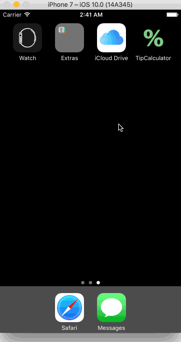

# TipCalculator

This is a Tip Calculator application for iOS submitted as the iOS Pre Work http://courses.codepath.com/snippets/intro_to_ios/prework.md requirement for Codepath.

Time spent: 5 hours

Completed:

* [x] Required: User can enter a bill amount, choose a tip percentage, and see the tip and total values.
* [x] Required: Settings page to select default tip percentage.
* [x] Optional: UI animations
* [x] Optional: Remembering the bill amount across app restarts. After an extended period of time, clear the state. This is a UI trick that Apple uses with the Spotlight app. If you return there a minute later, it will show your most recent search. if you return 10 minutes later, it defaults to blank.
* [x] Optional: Using locale-specific currency and currency thousands separators.
* [x] Optional: Making sure the keyboard is always visible and the bill amount is always the first responder. This way the user doesn't have to tap anywhere to use this app. Just launch the app and start typing.
* [x] Optional: Theming the Settings page like the main application page.
* [x] Optional: Remembering the tip percentage across app restarts.
* [x] Optional: Using locale specific currency and currency thousands separator.
* [x] Additional: Allow to input only one decimal point.

Notes:

I tested using iPhone 7 and 7 Plus. I did not spend time with other screen sizes.
It only works in Portrait orientation.
Going back from Settings to the main screen a blank view appears for a second, the problem is with the simulator:
Can't find keyplane that supports type 8 for keyboard iPhone-PortraitChoco-DecimalPad; using 3489728860_PortraitChoco_iPhone-Simple-Pad_Default
Selecting iOS Simulator -> Hardware -> Keyboard -> Connect Hardware Keyboard, the bug disappears, but the keyboard is not displayed

GIF created with [LiceCap](http://www.cockos.com/licecap/).
